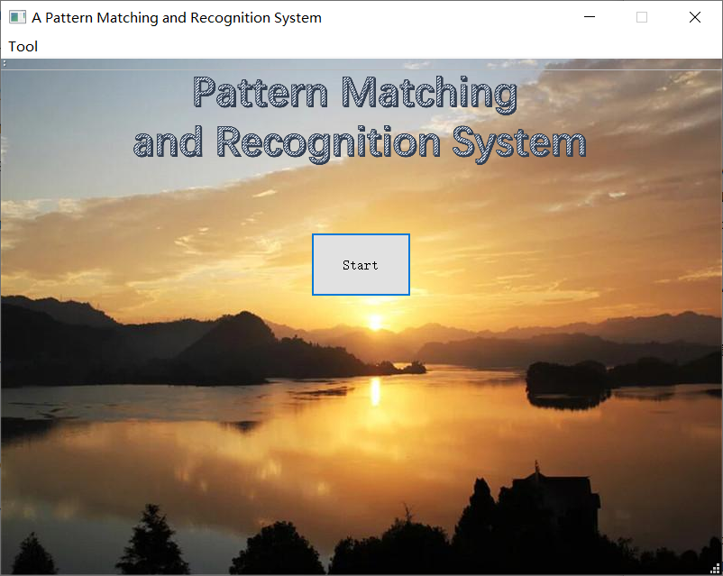
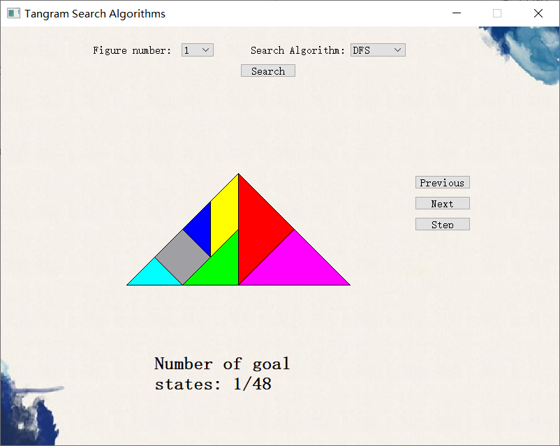
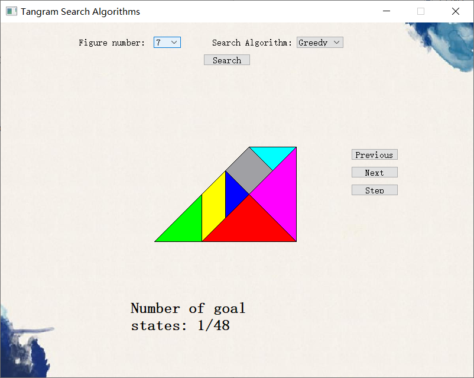

# **Tangram Pieces Matching and Recognition**

-----

>  Team:
>
>  [@Hongbo Wang ](https://github.com/BOBWang1117)
>
>  @Yichu Li
>
>  

## **Environment:**

- Qt Creator

  

## **Details**

- Type: term project

- Teacher: 曾祥财

- Computer Language: C++

- Project Name: Word-Processing-programs

- Time: 2020/05/12

- Description: The 13 convex polygons that can be spliced out of the tangram, find the maximum number of tangrams that each polygon can accommodate, and display it through the UI.

## **Dependencies:** 

- None

## **Install package:**

- None

## **Run program:**

Method 1:

- copy ./code into Qt Creator

  

Method 2:

- run Tangram.exe

  

 

## **Example:**

1. 

   

2. 

   

3. 

   

